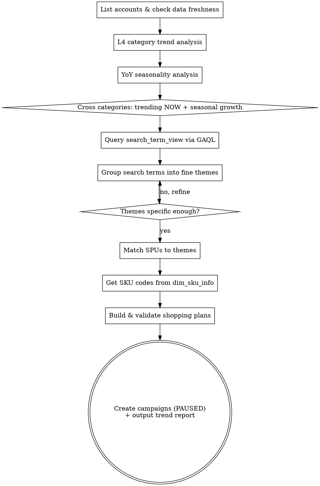

# Creating Trend-Based Shopping Ads

Identify high-confidence women’s fashion themes by combining warehouse performance data with Google Ads search-intent data, then turn the validated themes into paused Shopping campaigns through the MCP validation/create flow.

**Core principle:** Coarse-to-fine analysis with explicit handoffs. Start from category and seasonality, confirm demand with search terms, narrow to theme-level product groups, map to SPUs and SKUs, validate the plan, then create paused campaigns. Do not skip steps or jump directly from a product list to campaign creation.

At large budget scale, theme granularity is a financial control. A vague theme can waste meaningful budget quickly, so every theme must prove four things before launch: demand exists, the demand is recent, products actually match the intent, and the final campaign plan can be reviewed and approved by a human.

## What this skill must produce

This skill is not just for "finding ideas." It should carry the workflow all the way through to a launch-ready decision:

1. **Theme shortlist** — 3-10 themes with evidence from category trend + search-term demand
2. **Product mapping** — matched SPUs and SKU codes per theme
3. **Action recommendation** — for each theme: create now, hold, or exclude as duplicate/conflicting
4. **Creation package** — validated ShoppingPlan objects and approval-token-based creation path
5. **Final report** — one table covering performance evidence, campaign names, and action taken

## When to Use

- User asks to analyze shopping/pmax ad performance and create new campaigns
- User wants to find trending products worth advertising
- User asks to create themed shopping ads based on data
- Seasonal planning for upcoming months

## Process Flow



## Checklist

Create a task for each step:

1. **List accounts & check data freshness** — query `bi_warehouse_dw_gg_campaign_fact_daily` for account coverage, then check `MAX(day)` and recent distinct dates in `bi_warehouse_dw_gg_shopping_item_fact_daily` before trusting any trend math
2. **L4 category trend analysis** — compare recent vs previous periods using the freshest available dates; calculate cost, conversion value, ROAS, and growth%
3. **YoY seasonality analysis** — query the same months from last year to estimate which categories are entering a stronger seasonal window in the next 1-2 months
4. **Cross-filter categories** — keep only categories that are both improving recently and showing positive forward seasonality
5. **Search term analysis via GAQL** — query `search_term_view` for Shopping + PMax across all relevant accounts, usually last 90 days, and compare recent demand vs older demand
6. **Fine theme grouping** — convert raw search terms into narrow user-intent themes such as `wedding guest dresses`, `polka dot collection`, `denim jumpsuit`, `ballet flats & mary jane`; reject coarse buckets like `dresses`
7. **Match SPUs to themes** — join shopping fact with `dim_spu_info`; require theme/product-name fit, valid category fit, `is_alive=1`, usable inventory, and enough recent commercial proof
8. **Get SKU codes** — pull `sku_code` / `product_item_id` from `dim_sku_info` for matched SPUs; keep a manageable SKU set, usually ~5 SKUs per SPU
9. **Check duplication before creation** — query Google Ads for existing or recently created campaigns with the same theme; if a theme already exists or is clearly duplicative, exclude it instead of creating again
10. **Build shopping plans** — create ShoppingPlan objects with final campaign name, budget, merchant_id, bidding strategy, final_url_suffix, and SKU list
11. **Validate & create via MCP approval-token flow** — run `ads_validate_shopping_plan(plan)`, present `review_markdown`, confirm with the human, then pass only the returned `approval_token` into `ads_create_shopping_paused(approval_token)` within 30 minutes. If scope changes after validation (for example, removing a duplicate theme), rebuild and revalidate the plan before creating.
12. **Output trend report and action log** — output a single summary table showing what was analyzed, what was excluded, what was created, and the evidence behind those actions

## Data Sources & Key Tables

| Source | Table/API | Purpose |
|--------|-----------|---------|
| Data Warehouse (PostgreSQL) | `bi_warehouse_dw_gg_shopping_item_fact_daily` | SPU-level daily cost, clicks, conversions, conversion value; main source for 7d/30d theme performance |
| Data Warehouse | `bi_warehouse_dw_gg_campaign_fact_daily` | Campaign-level metrics and account coverage; use to enumerate active accounts and sanity-check scale |
| Data Warehouse | `dim_spu_info` | Product catalog with name, category (L1-L6), inventory, sales velocity, alive status |
| Data Warehouse | `dim_sku_info` | SKU codes / Merchant Center `product_item_id`; final creation payload source |
| Google Ads API (GAQL) | `search_term_view` | Search demand and intent validation; used to confirm whether a warehouse trend is actually query-backed |
| Google Ads API (GAQL) | `campaign` / `shopping_performance_view` | Existing-campaign duplication check and post-create verification |
| Google Ads API | `ads_validate_shopping_plan` | Validate ShoppingPlan and return `review_markdown` + `approval_token` |
| Google Ads API | `ads_create_shopping_paused` | Create validated campaigns in PAUSED state from `approval_token` |

**Connection:** Use `.env` for warehouse credentials. Use `.venv/bin/python3` with `google-ads.yaml` for GAQL and MCP-backed Google Ads calls.

## How to process the data

Treat the workflow as four distinct data layers. Do not collapse them into one fuzzy analysis step.

### 1. Warehouse performance layer
Use warehouse facts to answer: *which product areas are commercially meaningful already?*
- Build 7d / 30d category and theme views from `bi_warehouse_dw_gg_shopping_item_fact_daily`
- Aggregate cost and conversion value at the theme/SPU level
- Compute ROI/ROAS from actual sums, not averages of row-level ROAS
- Use this layer for budget sizing and for the final performance evidence table

### 2. Search-intent validation layer
Use `search_term_view` to answer: *is current market demand aligned with the theme?*
- Pull search terms across all relevant Shopping and PMax accounts
- Compare recent demand vs prior demand windows
- Group terms into specific user-intent clusters
- If the search terms are too broad or too mixed, do not promote the theme to campaign creation

### 3. Product eligibility layer
Use `dim_spu_info` + `dim_sku_info` to answer: *do we have enough good inventory to launch this theme?*
- Match SPUs by product-name relevance and category fit
- Filter to alive, in-stock, commercially proven products
- Convert approved SPUs into final SKU codes / `product_item_ids`
- Save or expose the final SPU/SKU mapping because this is the handoff into creation

### 4. Action layer
Use Google Ads campaign data and MCP tools to answer: *should we create, skip, or revise?*
- Check whether the theme already exists in account structure
- Exclude duplicates before validation
- Validate plan, present review, then create via approval token
- After creation, verify campaign names, IDs, and paused status

## Key Queries

### Category Trend (adjust dates for data freshness)
```sql
SELECT d.fourth_cate_en_name AS cat,
  SUM(CASE WHEN s.day::date >= '<recent_start>' THEN s.cost END) AS cost_recent,
  SUM(CASE WHEN s.day::date >= '<prev_start>' AND s.day::date <= '<prev_end>' THEN s.cost END) AS cost_prev,
  -- same for conversion_value, clicks
FROM bi_warehouse_dw_gg_shopping_item_fact_daily s
JOIN dim_spu_info d ON s.spu_code = d.spu_code
WHERE s.campaign_type IN ('SHOPPING', 'PERFORMANCE_MAX')
  AND d.fourth_cate_en_name IS NOT NULL
GROUP BY d.fourth_cate_en_name
```

### Search Terms (GAQL — use BETWEEN, not DURING)
```sql
SELECT search_term_view.search_term, segments.date,
  metrics.cost_micros, metrics.conversions, metrics.clicks,
  metrics.impressions, metrics.conversions_value
FROM search_term_view
WHERE segments.date BETWEEN '<start>' AND '<end>'
  AND campaign.advertising_channel_type IN ('SHOPPING', 'PERFORMANCE_MAX')
  AND metrics.cost_micros > 0
ORDER BY metrics.cost_micros DESC LIMIT 10000
```

### SPU Matching (theme-specific)
```sql
SELECT s.spu_code, d.product_name, d.fourth_cate_en_name,
  SUM(CASE WHEN s.day >= '<recent>' THEN s.conversion_value END) AS cv_recent
FROM bi_warehouse_dw_gg_shopping_item_fact_daily s
JOIN dim_spu_info d ON s.spu_code = d.spu_code
WHERE d.fourth_cate_en_name IN ('<target_cats>')
  AND d.is_alive = 1 AND d.free_inventory > 5
  AND LOWER(d.product_name) LIKE '%<theme_keyword>%'
GROUP BY s.spu_code, d.product_name, d.fourth_cate_en_name
HAVING SUM(CASE WHEN s.day >= '<recent>' THEN s.conversion_value END) > 20
ORDER BY cv_recent DESC LIMIT 15
```

## SPU Selection Criteria

| Filter | Threshold | Reason |
|--------|-----------|--------|
| is_alive | = 1 | Only active products |
| free_inventory | > 5 | Enough stock to fulfill |
| Recent conversion_value | > $20 (5d) | Proven performer |
| eROI / profitability proxy | > 1.25 preferred | Better aligned with current portfolio profitability target |
| Trend (recent vs prev) | Positive growth | Momentum indicator |

## Theme Granularity Rules

**Too coarse (avoid):** "Dresses", "Shoes", "Tops"
**Right level:** "Wedding Guest Dresses", "Polka Dot Collection", "Denim Jumpsuit & Rompers", "Ballet Flats & Mary Jane"

**How to find the right level:**
1. Look at top search terms by spend
2. Group by user intent (occasion, style, product type)
3. Each theme should map to 5-15 distinct search terms
4. Each theme should have 5-15 matchable SPUs

## Campaign Creation Defaults

| Parameter | Default | Notes |
|-----------|---------|-------|
| customer_id | Per account | Strip dashes for API |
| merchant_id | 514199227 | From existing campaigns or `ads_lookup_merchant_ids` |
| campaign_priority | 0 | Standard |
| bidding_strategy | TARGET_ROAS | Model default in `ShoppingCampaignPlan`; use for scalable themes with conversion history |
| target_roas | 3.0-5.0 | Set explicitly when using `TARGET_ROAS`; conservative start for large-budget fashion |
| target_countries | ["US"] | Adjust per market |
| final_url_suffix | `utm_source=google_shopping&utm_campaign=<campaign_name>` | Required for clean attribution |
| use_customer_conversion_goals | true | Reuse account-level conversion goals unless campaign-specific goals are required |
| status | PAUSED | Always create paused, enable manually |
| SKUs per ad group | ~50 | 10 SPUs x 5 SKUs each |
| Budget | 20,000,000-50,000,000 micros/day | 1,000,000 micros = $1; scale by theme size and ROAS |

`MAXIMIZE_CLICKS` is acceptable only for cold-start, low-risk theme tests. At large budget, do not use it as the universal default because it lacks a ROAS guardrail.

## Large-Budget Women's Fashion Operating Principles

- **Budget sizing by theme maturity**: proven themes with historical spend density can absorb materially higher budgets than new themes. Use small budgets for exploration, then scale only after query quality and product fit are proven.
- **Inventory depth matters**: `free_inventory > 5` is only a minimum filter. For themes expected to scale meaningfully, prefer deeper inventory and broader size/color availability to avoid quick stockouts after launch.
- **Campaign naming discipline**: keep the established pattern `ai-pla-<country>-<theme-slug>-<YYYYMMDD>`. Reporting, review, and downstream automation depend on consistent campaign names.
- **Multi-account trend union**: search-term and category trend analysis should aggregate across all relevant accounts before theme selection. Small signals often appear fragmented across markets before they become obvious in one account.
- **eROI vs ROAS**: when internal warehouse metrics and Google Ads metrics diverge, favor the warehouse-adjusted profitability view for portfolio decisions, but still use raw Google Ads query quality signals to validate theme intent.

## Required Output: Trend Report + Action Report

After analysis and any campaign creation, output one final summary table covering **every theme you considered**, not just the ones you created.

```
| Theme                      | Campaign Name                              | Action     | Evidence Source             | 7d Cost  | 7d ROI | 30d Cost  | 30d ROI | YoY M+1  | YoY M+2  | Notes |
|----------------------------|--------------------------------------------|------------|-----------------------------|----------|--------|-----------|---------|----------|----------|-------|
| Wedding Guest Dresses      | ai-pla-us-wedding-guest-dresses-20260327   | Excluded   | Existing campaign duplicate | $8,200   | 2.26   | $43,751   | 2.25    | +14%     | +12%     | Already exists in account |
| Polka Dot Collection       | ai-pla-us-polka-dot-collection-20260327    | Created    | Warehouse + search terms    | $1,890   | 2.05   | $6,320    | 1.93    | +38%     | +51%     | Created paused |
| Denim Jumpsuit             | ai-pla-us-denim-jumpsuit-20260327          | Created    | Warehouse + search terms    | $2,150   | 1.88   | $7,910    | 1.79    | +22%     | +31%     | Created paused |
| ...                        | ...                                        | ...        | ...                         | ...      | ...    | ...       | ...     | ...      | ...      | ... |
```

### Required columns
- **Theme** — final human-readable theme name
- **Campaign Name** — actual final campaign name, or existing campaign name if excluded as duplicate
- **Action** — one of `Created`, `Excluded`, `Hold`, `Validate only`
- **Evidence Source** — concise explanation such as `Warehouse + search terms`, `Existing campaign duplicate`, or `Insufficient SKU depth`
- **7d Cost / 7d ROI** — aggregated recent 7-day warehouse performance for the theme, using actual queried sums
- **30d Cost / 30d ROI** — aggregated recent 30-day warehouse performance for the theme, using actual queried sums
- **YoY M+1 / YoY M+2** — next-month and month+2 growth expectations from last year's seasonality data
- **Notes** — duplicate reason, validation outcome, created campaign ID/status, or why the theme was held back

### Reporting rules
- If a newly created campaign is too new to have delivery metrics, still report the theme-level warehouse performance used to justify creation
- If a theme is excluded because it already exists, keep it in the final table and mark it as `Excluded`
- If YoY fields were not yet queried, explicitly mark them as `Pending query`; do not fabricate them
- The final output should tell a human what was analyzed, what was created, what was skipped, and why

## Common Pitfalls

| Pitfall | Solution |
|---------|----------|
| `day` column is text in warehouse | Always cast: `s.day::date >= '...'` |
| Shopping item data has date gaps | Check `SELECT DISTINCT day ... ORDER BY day DESC LIMIT 10` first |
| GAQL `DURING LAST_90_DAYS` fails | Use `BETWEEN '<date>' AND '<date>'` instead |
| `dim_sku_info.free_stock_num` often NULL | Use `dim_spu_info.free_inventory` for stock check, `dim_sku_info` only for SKU codes |
| System python missing google-ads | Use `.venv/bin/python3` from project directory |
| Theme too broad = wasted budget | Refine with search term report before creating |
| Too many SKUs per ad group | Limit to ~50 SKUs (10 SPUs x 5 SKUs) for manageable campaigns |
| Passing the plan directly to `ads_create_shopping_paused` | Always call `ads_validate_shopping_plan(plan)` first and pass only the returned `approval_token` |
| Using `MAXIMIZE_CLICKS` as the universal default | Reserve it for low-risk cold starts; large-budget themes should usually start on `TARGET_ROAS` |

## MCP Tool Flow for Campaign Creation

These are MCP tools exposed by `/Users/cider/Developer/mcp-google-ads/google_ads_server.py`, invoked as tools rather than Python imports:

1. `ads_lookup_merchant_ids` — find `merchant_id` if it is not already known
2. `ads_validate_shopping_plan(plan)` — dry-run validation; returns `review_markdown` + `approval_token`
3. Review the validation summary and confirm the structure is correct
4. `ads_create_shopping_paused(approval_token)` — create campaigns and ad groups in `PAUSED` status

Important details:
- `approval_token` is single-use and expires after 30 minutes
- do **not** pass the plan directly to `ads_create_shopping_paused`
- the historical script `/Users/cider/Developer/mcp-google-ads/create_refined_campaigns.py` is a reference implementation, not the canonical MCP workflow
